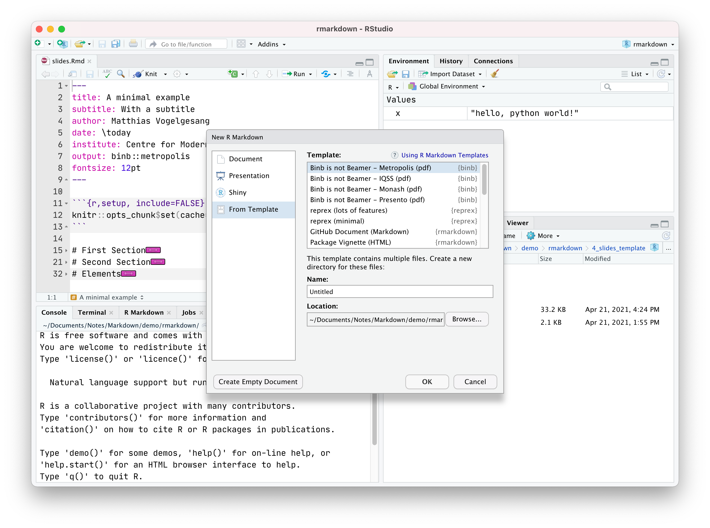

## Preface
### Outline

1. Why Markdown?
2. Learn Markdown Syntax with Typora
3. Use R Markdown with RStudio

### Material

Slides, notes and exercises are uploaded on GitHub: <https://github.com/iewaij/talkMarkdown>

### Software

To follow the exercises, you need install [Typora](http://typora.io/) and [RStudio](http://rstudio.com/).

# Why Markdown?

## Microsoft Word and LaTeX
### Microsoft Word

- No separation of content and formatting;
- Bad code syntax highlighting, math equation and citation support;
- Hard to generate graphs and visualizations.

### LaTeX

- Source code is way too bloated;
- Not really separate content from formats.

## An LaTeX Example

```latex
\documentclass[12pt, a4paper]{article}
\usepackage[utf8]{inputenc}

\title{A Simple Document}
\author{Jiawei Li}
\date{April 2021}
\begin{document}
\maketitle
Some of the \textbf{greatest}
discoveries in \textit{science}
were made by \textbf{\textit{accident}}.
\end{document}
```

## A Markdown Equivalent

```markdown
---
title: A Simple Document
author: Jiawei Li
date: April 2021
fontsize: 12pt
papersize: a4
---

Some of the **greatest**
discoveries in *science*
were made by ***accident***.
```

# Learn Markdown Syntax with Typora

## Sections
The headers start with a hashtag (`#`). Using one hashtag means a level-one header. Two hashtags means a level-two header.

```markdown
# Introduction
## Motivation
## History
### 1910s 
### 1920S
# Main Texts
# Conclusion
```

## Emphasize
Wrap asterisks (`*`) around the word to emphasize. One asterisk puts the work in italic and two asterisks put it in boldface.

```markdown
Some of the **greatest**
discoveries in *science*
were made by ***accident***.
```

## Numbered List
Put a number, followed by a period, at the start of a line and write the list item after it.

```markdown
1. This is a numbered list.
2. Where this is list item two.
3. And this is list item three.
	1. A numbered list inside a list.
	2. This is item 3.2.
```

## Unnumbered List
To create a unnumbered list, you simply put a dash (`-`) or an asterisk (`*`) in the beginning of the line.

```markdown
- This is a unnumbered list.
* Asterisk is fine.
- And this is list item three.
	- You can also indent a list here.
```

## Quote
Add a `>` before the quoted text.

```markdown
> The idea is that a Markdown-formatted document should be publishable
> as-is, as plain text, without looking like it’s been marked up with 
> tags or formatting instructions.
> If you want multiple lines where you include new lines,
> you should add the `>` to each line.
```

## Exercise 1: Countries' GDP

Open `exercises/1_gdp.md` with Typora and complete the following tasks:

1. Make a top level header "EU Countries Ordered by GDP". 
2. Quote the famous "in the long run we all die" sentence by Keynes.
3. Create a numbered list of countries below ordered by their GDP. Note that some nations of The UK should be indented. 
4. Emphasize **Germany** by making it bold.

**Bonus:** Strike out UK and its nations since it has left EU.

## Links

Links can be created by using both `[]` and `()`, e.g. 

```markdown
[YouTube](https://youtube.com/)
```
The result will look like this:

[YouTube](https://youtube.com/)

## Images

Syntax for inserting image is similiar to links with `!` in the beginning.

```markdown

```

The result will look like this:

{ width=30% }

## Inline Code

Inline code can be identified by backticks (`` ` ``).

```markdown
Variable can be assigned using `a = 12`.
```
The result will look like this:

Variable can be assigned using `a = 12`.

## Code Block
Code block should be surrounded by three backticks.

````markdown
```python
print("Hello World!")
```
````

The result will look like this:

```python
print("Hello World!")
```

## Inline Math

Inline math follows the same logic of inline code. Inline math is wrapped by the dollar sign (`$`).

```markdown
Here we define $m = ab$.
```
The result will look like this:

Here we define $m = ab$.

## Math Block

A math block is surrounded by two dollar signs (`$`).

```markdown
We know that

$$
e = mc^2
$$
```
The result will look like this:

We know that

$$
e = mc^2
$$

## Math Block

You may find [Mathpix](https://mathpix.com/), an OCR tool for math equations, very helpful.

## Exercise 2: Badges and Stuff

[Shields.io](https://shields.io/category/social) is a website that generates badges. Open `exercises/2_badges.md` with Typora and complete the following tasks:

1. Create two YouTube channel badges which are linked to a YouTube Channel.
2. Create a thumbnail image stored in `figures` folder which is also linked to a YouTube video.
3. Finish off with a line of Python code and a math equation.

**Bonus:** Add another formula which is Euler's identity.

$$
e^{i\pi} + 1 = 0
$$

# Use R Markdown with RStudio

## Metadata

The Markdown file can include metadata that describes the formats and detailed information, e.g. title and author.

```markdown
---
title: A Report Genrated by R Markdown
author: Jiawei Li
date: 21 April, 2021
abstract: Here are some words.
---

Some texts.
```

## Metadata
The margins, document class (article, report or book) and fontsize can be described as well.

```markdown
---
geometry:
  - top=30mm
  - left=30mm
  - right=30mm
  - bottom=30mm
  - heightrounded
fontsize: 12
toc: true
toc_depth: 2
documentclass: article
---
```

## Pagebreak

I usually add a `\pagebreak` after the header to separate the table of contents  from main contents. I also add another `\pagebreak` before references.

```markdown
---
toc: true
documentclass: article
---
\pagebreak

Some texts.

\pagebreak

# References
```

## Citations

Citations can be inserted in the header as well, though you need generate a BibTex file from [ZoteroBib](https://zbib.org/) and a specific citation style file from [Zotero Style Repository](https://www.zotero.org/styles).

```markdown
---
bibliography: citation.bib
csl: harvard-cite-them-right.csl
---
```

## Exercise 3: Theses
Open `exercises/3_thesis.Rmd` with RStudio and complete the following tasks:

1. Generate a thesis with author name, date, abstract and a table of contents.
2. Cite the book "Forecasting: Principles and Practice".

**Bonus:** Numbered each section. For example, "Introduction" is "1. Introduction". You may not write these numbers explicitly.

## Tables 

You can generate tables using Markdown syntax only.

```markdown
| Country        | GDP       |
| -------------- | --------- |
| Germany        | 4,319,286 |
| United Kingdom | 3,124,650 |
| France         | 2,938,271 |
| Italy          | 2,106,287 |
| Spain          | 1,461,552 |
| Netherlands    | 1,012,598 |
Table Title: This is table caption
```

## Tables

Run the code to generate a table. Simply add a `{r}` in your code fence, the code then become executable in RStudio.

````markdown

```{r, include = FALSE, echo = FALSE}
library(tidyverse)
library(knitr)
```

```{r}
kable(mpg[1:5,], caption = "A table")
```

````

## Graphs

You can also generate graphs for you the report.

````markdown

```{r, caption = "A graph"}
ggplot(data = mpg) + 
  geom_point(mapping = aes(x = displ, y = hwy, color = class))
```

````

## Templates

Install `stevetemplates` and `binb`, then you can start using the templates when create a new R Markdown document.

{ height=65% }

## How R Markdown Works


Internally, R Markdown run the R code in the file and insert the code's output into the text you wrote. The file will then be translated into a PDF or html using Pandoc.

If you are comfortable with command line and do not need code execution, simply run like this:

```markdown
pandoc --citeproc --pdf-engine=xelatex -o your_work.pdf your_work.md
```
## Conclusion

> We shape our tools and our tools shape us.
> -- Marshall McLuhan
